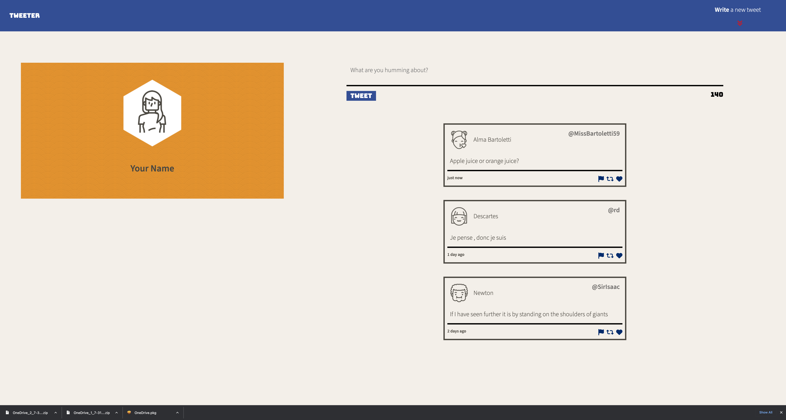
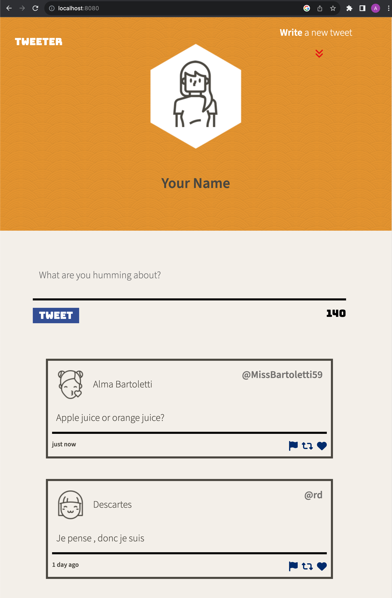
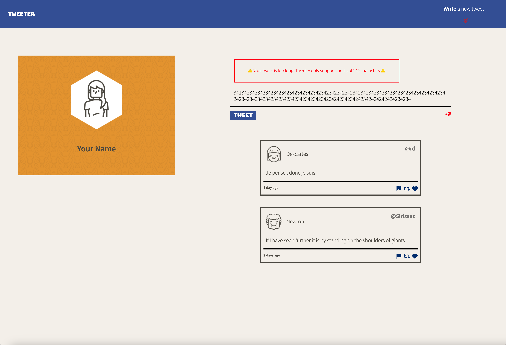
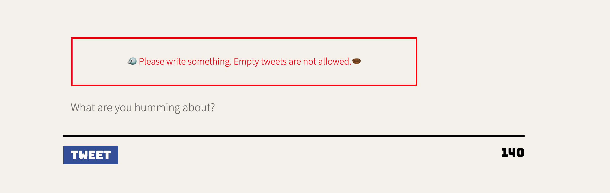

# Tweeter Project

Tweeter is a simple, single-page Twitter clone designed to practice HTML, CSS, JS, jQuery, AJAX for front-end, and Node Express for back-end development.

## Overview

Tweeter allows users to share short messages (tweets) with the world. It provides a streamlined interface for composing tweets and viewing a timeline of recent posts.

## Preview
**Desktop view:**

**Mobile view:**

**Warnings for Character Limits**

**No More Empty Posts**

## Getting Started

1. [Create](https://docs.github.com/en/repositories/creating-and-managing-repositories/creating-a-repository-from-a-template) a new repository using this repository as a template.
2. Clone your repository onto your local device.
3. Install dependencies using the `npm install` command.
4. Start the web server using the `npm run local` command. The app will be served at <http://localhost:8080/>.
5. Go to <http://localhost:8080/> in your browser.

## Usage

To use Tweeter, simply compose your tweet in the input field and click "Tweet". Your message will be added to the timeline for others to see.

## Dependencies

- Express
- Node 5.10.x or above
- Body-parser: 1.15.2
- Chance: 1.0.2

## Contributing

Contributions are welcome! If you have ideas for new features or find bugs, please submit an issue or a pull request. For major changes, please open an issue first to discuss your ideas.

## Credits

- [Express](https://expressjs.com/)
- [Node.js](https://nodejs.org/)
- [jQuery](https://jquery.com/)

## Disclaimer

This project is for educational purposes only and is not intended for production use.
